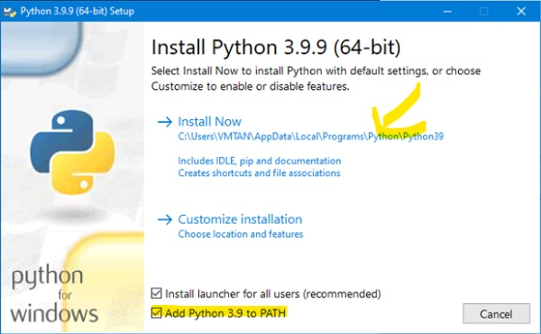

<b>1. Cài đặt python 3.9.9. Nhớ tích như hình bên dưới</b>

Link download: https://www.python.org/ftp/python/3.9.9/python-3.9.9-amd64.exe

<b>2. Giải nén và chạy file setup.bat trong thư mục setup. Quay lại 1 bước. tìm file Gmail Changer mở nó lên là được</b>

https://github.com/emga9xkc2/gmail-changer/archive/refs/heads/main.zip

<b>3. Hướng dẫn sử dụng</b>

[x] Tool chỉ đổi mật khẩu và email khôi phục, mỗi nick 1 lần. 
Nếu muốn đổi lại mật khẩu 1 lần nữa. Hãy mở SETTINGS => PASSWORD KEY => đổi các ký tự trong đó thành 4 ký tự khác 
Nếu muốn đổi lại email khôi phục 1 lần nữa. Hãy mở SETTINGS => EMAIL RECOVERY DOMAIN => đổi các ký tự trong đó thành 5 ký tự khác kèm @outlook.com 
[x] CHANGE IP = 911 

1. Tải 911 về máy, đăng nhập tk mk.
2. Mở SETTING => PROXY => 911. Nhập danh sách quốc gia cần random vào. mỗi quốc gia 1 dòng. Ví dụ: 
   US 
   VN 

[x] XÓA MAIL 

1. Xuất ra mail 
2. Copy mail cần xóa ở file xuất 
3. Vào menu chọn Xóa mail. Dán các mail vừa copy vào rồi ấn xóa 

[x] VERIFY PHONE 

1. Để dùng verify phone. Bấm settings => verify phone. Nhập định dạng như mẫu. (xxxxx là api key lấy ở web sim) ví dụ: https://tempcode.co/api/orders.php | xxxxx | 1 
2. Tích chọn verify phone trên giao diện 
3. Để cài đặt thời gian đợi code. Bấm HELP => OPEN HCONFIG. Thêm dòng này vào cuối rồi lưu lại: otptimeout = 60 
4. Để cài đặt số lần thử lại trên 1 số. Bấm HELP => OPEN HCONFIG. Thêm dòng này vào cuối rồi lưu lại: solanverify1so = 3 

<b>Cài đặt thêm</b>

- Nếu change ip bằng vpn hoặc dcom thì cài thêm phần mềm này: https://digi.bib.uni-mannheim.de/tesseract/tesseract-ocr-w64-setup-v5.0.1.20220118.exe

<b>4. Thông tin phiên bản</b>

- v5.1

  Hỗ trợ vpn ipvanish bản mới 

- v5.0

  Fix lỗi lấy thông tin youtube 

- v4.8

  Fix lỗi không hỗ trợ chrome 102 

- v4.7

  Fix lỗi check youtube 
  Fix lỗi user32.dll 

- v4.6

  Thêm chức năng gom lô mail. (vào web mail để sử dụng) 
  Thêm chức năng chạy theo danh sách lô mail, bấm WEB MAIL => LÔ MAIL => Nhập danh sách lô mail. Lô mail này được tạo ra trong lúc thêm mail trên web 
  Sửa lỗi bị đứng khi gặp mail yêu cầu xác nhận USB 

- v4.4

  Thêm change ip = 911 
  Thêm cài change ip sau x lần 
  Sửa lỗi check phương thức thanh toán 

- v4.2

  Sửa lỗi không đóng chrome khi dùng proxy 

- v3.12

  Hỗ trợ định dạng thêm mail. Có thể copy trực tiếp từ excel nhập vào. 
  Các định dạng: email|pass|emailrecovery, email pass emailrecovery, email:pass:emailrecovery 

- v3.11

  Sửa lỗi đăng xuất thiết bị 

- v3.9

  Thêm change ip bằng HMA bản mới nhất 

- v3.8

  Fix 1 số lỗi 

- v3.0

  Fix lỗi không đóng hết chrome 
  Fix xóa mail theo id, tránh xóa nhầm các mail nhập vào giống nhau 
  Thêm chức năng random user agent, mặc định có sẵn 328k user agent trong tool 
  Thêm xuất mail gồm 4 file: Tất cả, đăng nhập thành công, chưa chạy, đăng nhập thất bại 

- v2.6

  Thêm tính năng tắt hình ảnh chrome 
  Yêu cầu nhập key khi chạy tool. 

- v2.5

  Thêm chức năng check live die, khi chọn chức năng này sẽ chỉ kiểm tra xem mail đó còn tồn tại hay không 
  Fix đơ khi dùng chức năng đóng phương thức thanh toán 

- v2.4

  Hỗ trợ proxy user pass. Định dạng: `ip:port:user:pass` 
  Hỗ trợ nhập key chuyển máy tự do 

- v2.3

  Thêm chức năng giới hạn số kênh check youtube. Để dùng chức năng này. mở file hconfig.ini thêm dòng này vào cuối file rồi lưu lại: `limityoutube = 10` 
  Số 10 ở trên là giới hạn 10 kênh 
  Thêm đếm mail khi đang chạy 

- v2.1

  Thêm chạy theo lô mail. Để dùng vào menu WEBMAIL => LÔ MAIL. nhập tên lô mail vào đó. để lấy tên LÔ MAIL lúc ADD MAIL hãy đặt tên lô mail. 
  Thêm xuất email khôi phục gợi ý khi đăng nhập thất bại 
  Thêm chức năng tự động mở lại tool khi bị tắt. Để dùng chức năng này. mở file hconfig.ini thêm dòng này vào cuối file rồi lưu lại: `autorun = True`
  Và chạy file setup/ProcessManager/ProcessManager.exe 

- v2.0

  Thêm xác nhận cảnh báo đăng nhập 
  Thêm chức năng UPDATE tool. Nếu muốn cập nhật bản mới. Hãy bấm HELP => UPDATE 

- v1.8

  Hỗ trợ định dạng mail nhập vào: mail|pass|mailkhoiphuc|sdtkhoiphuc 
  Cập nhật cơ chế thay pass và email khôi phục mới 
  Thêm Express VPN 
  Fix menu WEBMAIL không bấm được 

- v1.7

  Tự file backup file mỗi khi xóa mail (Nhớ xóa nhầm còn có thể lấy lại) 
  Random password và email khôi phục trong file. Muốn chỉnh sửa vào SETTINGS chọn PASS WORD hoặc EMAIL RECOVERY (Nếu sửa nhập tối thiểu 10 dòng) 
